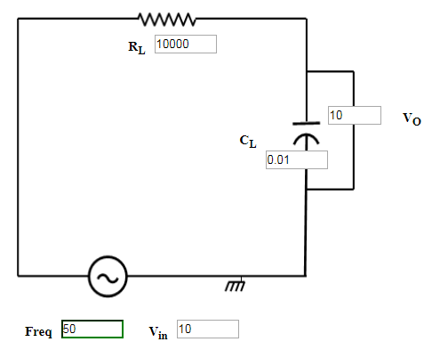
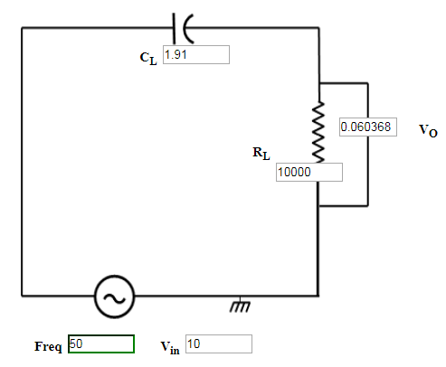

### Procedure

### Frequency Response of RC Low Pass Filter
1. Set Load Resistance(RL)=10 K&#937;.
2. Set Load Capacitor(CL)=0.01nF.
3. The source voltage (Vin) is set to 10V.
4. Keeping source voltage constant, vary the frequency from 50 Hz in regular steps.                           
5. Click on "Add to Table" button to add the readings to the table.
6. Vary the Frequency by keeping the load resistances and load capacitance constant.                            
7. Select  "Plot" button to plot the frequency graph or the phase graph  of the RC frequency, Frequency(Hz) along X-axis and Magnitude(dB) along Y-axis.
8. Click on "Clear" button to take another set of readings.
                                    

Figure:1

### Frequency Response of RC High Pass Filter
                            
1. Set Load Resistance(RL)=10 K&#937;.
2. Set Load Capacitor(CL)=1.91nF.
3. The source voltage (Vin) is set to 10V.
4. Keeping source voltage constant, vary the frequency from 50 Hz in regular steps.                       
5. Click on "Add to Table" button to add the readings to the table.
6. Vary the Frequency by keeping the load resistances and load capacitance constant.                            
7. Select  "Plot" button to plot the frequency graph or the phase graph  of the RC frequency, Frequency(Hz) along X-axis and Magnitude(dB) along Y-axis.
8. Click on "Clear" button to take another set of readings.

Figure:2

