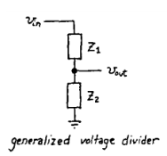
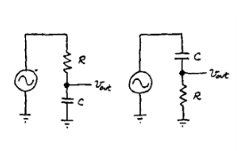
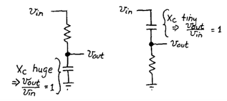
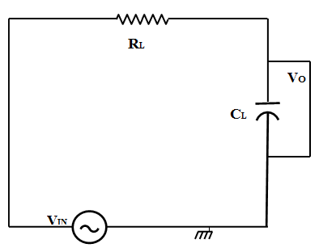
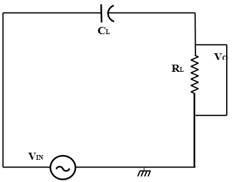

# Theory

### RC Circuit as Filters 
A filter is a circuit that allows to pass a specified range of frequency components, while blocking or “attenuating” the rest according to the frequency range of signals. The most commonly used filter designs are as follows:

1. The Low Pass Filter- Filter passes low frequencies and blocks high frequencies.It only allows low frequency signals from 0Hz to its cut-off frequency, (\(f_{C}\)) point to pass while blocking those any higher.
2. The High Pass Filter-Filter passes high frequencies and  blocks low frequencies.
    It only allows high frequency signals from its cut-off frequency, (\(f_{C}\)) point and higher to infinity to pass through while blocking those any lower.
3. The Band Pass Filter- Filter  passes only a relatively narrow range of frequencies. 
    It allows signals falling within a certain frequency band setup between two points to pass through while blocking both the lower and higher frequencies either side of this frequency band.

Filters can also be classified according to the types of components that are used to implement the circuit. 
Passive filters are made up of passive components such as resistors, capacitors and inductors and have no amplifying 
elements (transistors, op-amps, etc) so have no signal gain, 
therefore their output level is always less than the input.

### TRC Voltage Dividers

Figure 1 

Figure 2 

Let us consider RC circuits as voltage dividers to understand how they would perform as ‘filters’.
Note that Vout = ( Z2/ Z1 + Z2 )*Vin. In this case – Since Z1 or Z2 is dependent upon frequency, the output is dependent upon the frequency of the input waveform.

Figure 3 

RC as Low Pass filter

A simple passive RC Low Pass Filter or LPF, can be easily made by connecting together in series a single Resistor with a single Capacitor as shown below.

Figure 4 

In this type of filter arrangement the input signal (Vin) is applied to the series combination (both the Resistor and Capacitor together) but the output signal (Vout) is taken across the capacitor only. The reactance of a capacitor varies inversely with frequency, while the value of the resistor remains constant as the frequency changes. At low frequencies the capacitive reactance, (XC) of the capacitor will be very large compared to the resistive value of the resistor,R. Voltage across the capacitor will be much larger than the voltage drop developed across the resistor. At high frequencies the reverse is true with (VC) being small and (VR) being large due to the change in the capacitive reactance value. Thus, low frequencies are passed and high frequencies are blocked.

### Cut-off Frequency
The cutoff frequency of an RC low-pass filter is the frequency at which the amplitude of the input signal is reduced by 3 dB (this value was chosen because a 3 dB reduction in amplitude corresponds to a 50% reduction in power). Thus, the cutoff frequency is also called the –3 dB frequency. The term bandwidth refers to the width of a filter’s passband, and in the case of a low-pass filter, the bandwidth is equal to the –3 dB frequency The cutoff frequency (fc) of an RC low-pass filter is calculated as follows:

$$\frac{1}{2 {\pi} R_L C_L}$$

Capacitive Reactance
The reactance of a capacitor indicates the amount of opposition to current flow, but unlike resistance, the amount of opposition depends on the frequency of the signal passing through the capacitor. Thus, to calculate reactance at a specific frequency, following equation is used:

$$X_C=\frac {1}{2 {\pi}  f  C_L}$$
$$Z=\sqrt{R_L^ 2 +X_C^2}$$
$$Magnitude=20  log{(\frac{X_C}{Z})}$$
$$ V_{out}=V_{in}  (\frac{X_C}{Z})$$

### Low-Pass Filter Phase Shift
Each reactive element in a circuit introduces 90° of phase shift, but this phase shift does not happen all at once. The phase of the output signal, just like the magnitude of the output signal, changes gradually as the input frequency increases. In an RC low-pass filter, we have one reactive element i.e. the capacitor, and consequently the circuit will eventually introduce 90° of phase shift.

$$\phi =-arctan(2  3.14  f  C_L  R_L)$$

### High pass filter
A simple passive RC High Pass Filter or HPF, can be easily made by connecting together in series a single Resistor with a single Capacitor as shown below. In this type of filter arrangement the input signal (Vin) is applied to the series combination (both the Resistor and Capacitor together) but the output signal (Vout) is taken across the resistor only.

Figure 4 

In this circuit, the reactance of the capacitor is very high at low frequencies so the capacitor acts like an open circuit and blocks any input signals at (Vin) until the cut-off frequency point (fC) is reached. Above this cut-off frequency point the reactance of the capacitor has reduced sufficiently as to now act more like a short circuit allowing all of the input signal to pass directly to the output as shown below in the filters response curve.

$$Magnitude=20  \log{(\frac{R}{Z})}$$
$$ V_{out}=V_{in}  (\frac{R}{Z})$$

